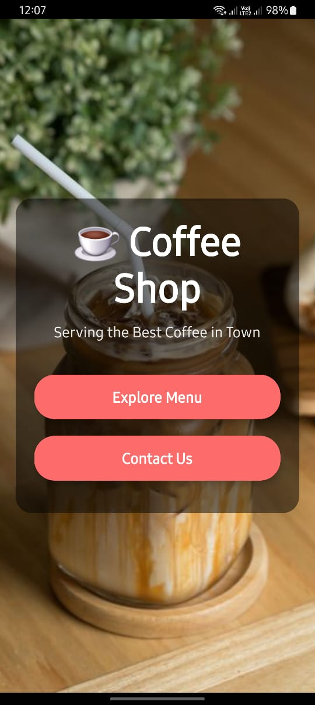
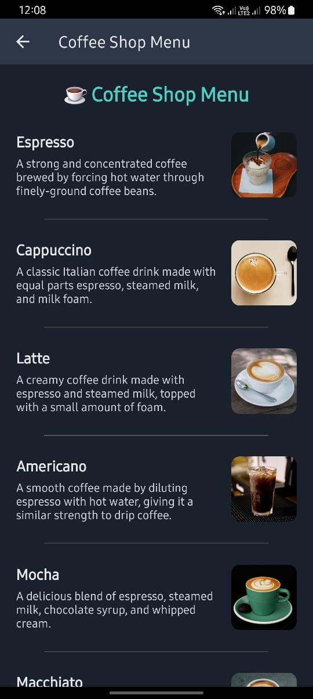
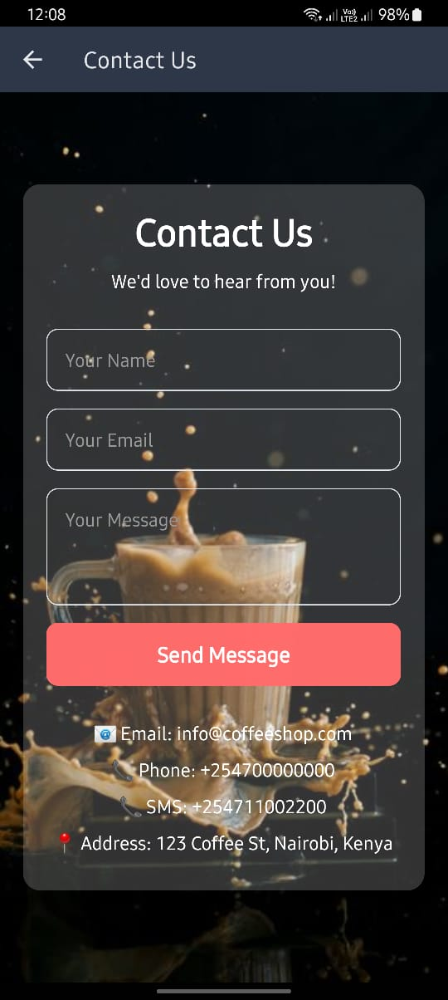

# ☕ Coffee Shop App

Welcome to the **Coffee Shop App**! This is a React Native application designed to showcase a coffee shop menu, provide contact information, and allow users to explore the offerings of a coffee shop.

---

## Features

- **Menu Page**: Displays a list of coffee items with descriptions and images.
- **Contact Page**: Allows users to contact the coffee shop via email, phone, or SMS.
- **Home Page**: A visually appealing landing page with a call-to-action button to explore the menu.
- **Responsive Design**: Works seamlessly on both mobile and web platforms.
- **Dark and Light Themes**: Supports system-wide dark and light modes.

---
## Screenshots

### Home Page


### Menu Page


### Contact Page


## Technologies Used

- **React Native**: For building cross-platform mobile apps.
- **Expo Router**: For navigation between screens.
- **Expo Vector Icons**: For icons used in the app.
- **React Native Linking**: For handling email, phone, and SMS links.
- **TypeScript**: For type-safe development.

---

## Installation

Follow these steps to set up and run the app locally:

1. **Clone the repository**:
   ```bash
   git clone https://github.com/mbithi002/Coffee-Mobile-App.git
   cd coffee-shop-app